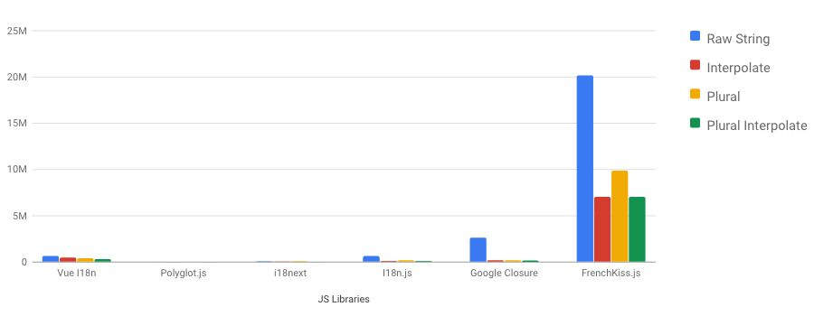

<div align="center">
  <h1>💋 FrenchKiss.js</h1>

[](https://travis-ci.com/koala-interactive/frenchkiss.js)
[](./dist/umd/frenchkiss.js)


[](https://opensource.org/licenses/MIT)

</div>

FrenchKiss.js is a blazing fast lightweight i18n library written in JavaScript, working both in the browser and NodeJS environments. It provides a simple and really fast solution for handling internationalization.

FrenchKiss is by now, _the fastest i18n JS package_ out there, working **5 to 1000 times faster** than any others by **JIT compiling** the translations, try it by running the benchmarks !

> #### Minimum requirements:
>
>  

⚠️  Frenchkiss is internaly using `new Function()` to create optimized functions. Therefore it can conflict when using [CSP (Content Security Policy)](https://developer.mozilla.org/en-US/docs/Web/HTTP/CSP) rules.
You can bypass it by disabling it by using the CSP keyword `unsafe-eval`, but it is generally not recommended as it would weaken the protections offered by CSP.
We will eventually work on a new version offering pre-compilation.

---

## 🚀 Installation

Install with [yarn](https://yarnpkg.com):

    $ yarn add frenchkiss

Or install using [npm](https://npmjs.org):

    $ npm i frenchkiss

---

## ⏳ Running the tests

    $ npm test

---

## ⚙️ Running the benchmarks

    $ cd benchmark
    $ yarn
    $ yarn start
    $ open ./result.html



---

## 📖 Documentation

- [frenchkiss.locale()](#frenchkisslocalelanguage-string-string)
- [frenchkiss.set()](#frenchkisssetlanguage-string-table-object)
- [frenchkiss.t()](#frenchkisstkey-string-params-object-lang-string-string)
- [frenchkiss.extend()](#frenchkissextendlanguage-string-table-object)
- [frenchkiss.unset()](#frenchkiss.unsetlanguage-string)
- [frenchkiss.fallback()](#frenchkissfallbacklanguage-string-string)
- [frenchkiss.onMissingKey()](#frenchkissonMissingKeyfn-Function)
- [frenchkiss.onMissingVariable()](#frenchkissonMissingVariablefn-Function)
- [Nested keys](#nested-keys)
- [SELECT expression](#select-expression)
- [PLURAL expression](#plural-expression)
- [Plural category](#plural-category)
- [Nested expressions](#nested-expressions)

### Minimal code

Tell FrenchKiss what to return by simply giving it a table object, where the key is the search reference and the value is the already-translated string.

```js
import frenchkiss from 'frenchkiss';

// Define the locale language
frenchkiss.locale('en');

// Add translations in each languages
frenchkiss.set('en', {
  hello: 'Hello {name} !',
  fruits: {
    apple: 'apples'
  },
  // and other sentences...
});

frenchkiss.t('hello', {
  name: 'John',
}); // => 'Hello John !'

frenchkiss.t('fruits.apple'); // => 'apples'
```

---

### frenchkiss.locale(language?: string): string

Get or set the locale, it will define what table FrenchKiss have to work with.

> **Note:** If you are working with NodeJS and concurrent requests, you can use the third parameter (language) of `t()` to avoid language collision.

---

### frenchkiss.set(language: string, table: object)

Define the translation table for the language. Any call to the specified language erase all the previously stored data.

```js
frenchkiss.set('en', {
  hello: 'Hi, ',
  howareyou: 'How are you ?',
  // ...
});
```

---

### frenchkiss.t(key: string, params?: object, lang?: string): string

The most used method to returns translation. It's built with performance in mind.
Here is what you should know about it :

- ✅ It does support multiple interpolation variable
- ✅ It supports interpolation.
- ✅ It supports `PLURAL`.
- ✅ It supports `SELECT`.
- ✅ It supports nested `PLURAL`, `SELECT` and `variables`.
- ✅ It supports nested keys (using dots in keys).
- ❌ It does not support date, number, currency formatting (maybe check for [Intl.NumberFormat](https://developer.mozilla.org/fr/docs/Web/JavaScript/Reference/Objets_globaux/NumberFormat) and [Intl.DateTimeFormat](https://developer.mozilla.org/fr/docs/Web/JavaScript/Reference/Objets_globaux/DateTimeFormat)).

```js
set('en', {
  hello: 'Hello {name} !',
});

t('hello'); // => 'Hello  !'
t('hello', { name: 'John' }); // => 'Hello John !'
t('hello', { name: 'Anna' }); // => 'Hello Anna !'
```

> **Note:** By default, if no parameters are given it will be interpreted as an empty string.

If you are working with concurrent connections it's also possible to use the third parameter `lang` to force the language to use.
Doing a generator that forces the language use and pass it to your function can be what you are looking for.

```js
frenchkiss.locale('fr');
frenchkiss.set('en', {
  hello: 'Hello {name} !',
});

// Helper
const generateLanguageTranslator = lang => {
  return (key, params) => frenchkiss.t(key, params, lang);
};

// Generate t that force language
const t = generateLanguageTranslator('en');

// Force result in english
t('hello'); // => 'Hello  !'
t('hello', { name: 'John' }); // => 'Hello John !'
t('hello', { name: 'Anna' }); // => 'Hello Anna !'
```

---

### frenchkiss.extend(language: string, table: object)

Extend the translation table for the language. In contrary of `set()`, the previously stored data will be kept.

---

### frenchkiss.unset(language: string)

If you need to clean the data of a stored language for memory optimizations, unset is all you need.

---

### frenchkiss.fallback(language?: string): string

Get or set the fallback. Define what table FrenchKiss will use to fallback in case the locale table doesn't have the required translation.

```js
import { locale, fallback, set, t } from 'frenchkiss';

set('fr', {
  hello: 'Bonjour, ',
});

set('en', {
  hello: 'Hi, ',
  howareyou: 'How are you ?',
});

locale('fr');
fallback('en');

t('hello'); // => 'Bonjour, ' <- from 'fr' locale
t('howareyou'); // => 'How are you ?' <- from 'en' fallback
```

---

### frenchkiss.onMissingKey(fn: Function)

When the client requests a missing key, frenchKiss will returns the key as result. It's possible to handle it and return what you want or just send an event to your error reporting system.

```js
frenchkiss.t('missingkey'); // => 'missingkey'

frenchkiss.onMissingKey((key, params, locale) => {
  // Send error to your server
  sendReport(`Missing the key "${key}" in ${frenchkiss.locale()} language.`);

  // Returns the text you want
  return `An error happened (${key})`;
});

frenchkiss.t('missingkey'); // => 'An error happened (missingkey)'
```

---

### frenchkiss.onMissingVariable(fn: Function)

It's possible to handle missing variables, sending errors to your monitoring server or handle it directly by returning something to replace with.

```js
frenchkiss.set('en', {
  hello: 'Hello {name} !',
});
frenchkiss.locale('en');

frenchkiss.t('hello'); // => 'Hello  !'

frenchkiss.onMissingVariable((variable, key, language) => {
  // Send error to your server
  sendReport(`Missing the variable "${variable}" in ${language}->${key}.`);

  // Returns the text you want
  return `[missing:${variable}]`;
});

frenchkiss.t('hello'); // => 'Hello [missing:name] !'
```

---

### Nested keys

Under the hood, frenchkiss allows you to handle nested keys, by using `'.'` inside key names.

```js
frenchkiss.set('en', {
  fruits: {
    apple: 'An apple',
    banana: 'A banana'
  },
  vegetables: {
    carrot: 'A carrot',
    daikon: 'A daikon'
  }
});

frenchkiss.t('fruits.apple') // => 'An apple'
```

Accessing an object directly will result on the `onMissingKey` method to be called:

```js
frenchkiss.set('en', {
  fruits: {
    apple: 'An apple',
    banana: 'A banana'
  }
});

frenchkiss.onMissingKey(key => `[notfound:${key}]`);
frenchkiss.t('fruits'); // => '[notfound:fruits]'
```

In case of duplicate names on key and objects, do not expect the result to be uniform (in fact, just don't do it).

```js
frenchkiss.set('en', {
  'fruits.apple.green': 1,
  'fruits.apple': {
    'green': 2
  },
  'fruits': {
    'apple.green': 3
    'apple': {
      'green': 4
    }
  }
});

frenchkiss.t('fruits.apple.green'); // => '1' or '2' or '3' or '4'
```

---

### SELECT expression

If you need to display different text messages depending on the value of a variable, you need to translate all of those text messages... or you can handle this with a select ICU expression.

```js
set('en', {
  your_pet:
    'You own {pet, select, dog{a good boy} cat{an evil cat} other{a {pet} ! What is that?}}!',
});

t('your_pet', { pet: 'dog' }); // => 'You own a good boy!'
t('your_pet', { pet: 'cat' }); // => 'You own an evil cat!'
t('your_pet', { pet: 'rat' }); // => 'You own a rat ! What is that?!'
```

- The first parameter is the variable you want to check (`pet`).
- The second parameter identifies this as a `select` expression type.
- The third parameter is a pattern consisting of keys and their matching values.

> Phrases support select expression, based on [ICU FormatMessage](http://userguide.icu-project.org/formatparse/messages).

---

### PLURAL expression

It's basically the same as select, except you have to use the "=" symbol for direct checking.

```js
set('en', {
  bought_apple:
    'I {count, plural, =0{bought no apples} =1{bought one apple} other{bought {count} apples}}!',
});

t('bought_apple', { count: 0 }); // => 'I bought no apples!'
t('bought_apple', { count: 1 }); // => 'I bought one apple!'
t('bought_apple', { count: 5 }); // => 'I bought 5 apples!'
```

- The first parameter is the variable you want to check.
- The second parameter identifies this as a `plural` expression type.
- The third parameter is a pattern consisting of keys and their matching values.

> ⚠️ Like the select expression, the plural is a lightweight version of [ICU FormatMessage](http://userguide.icu-project.org/formatparse/messages) (`offset:1` and `#` are not integrated).

---

### Plural Category

It's also possible to work with plural category. Multiple languages have multiple pluralization rules. You'll have to write a function returning the type to check.
The functions are not included by default in the package (not needed in most cases). But you can get some of them from [PLURAL.md](./PLURAL.md) file.

```js
import { locale, set, t, plural } from 'frenchkiss';

set('en', {
  takemymoney:
    'Take {N} dollar{N, plural, one{} =5{s! Take it} other{s}} please.',
});
set('fr', {
  takemymoney:
    "Prenez {N} dollar{N, plural, one{} =5{s! Prenez le} other{s}} s'il vous plait.",
});

// Set here your plural category function
plural('en', n => {
  const i = Math.floor(Math.abs(n));
  const v = n.toString().replace(/^[^.]*\.?/, '').length;
  return i === 1 && v === 0 ? 'one' : 'other';
});

plural('fr', n => {
  const i = Math.floor(Math.abs(n));
  return i === 0 || i === 1 ? 'one' : 'other';
});
// etc.

locale('en'); // rules to locale = 'en'
t('takemymoney', { N: 0 }); // => "Take 0 dollars please."
t('takemymoney', { N: 1 }); // => "Take 1 dollar please."
t('takemymoney', { N: 2 }); // => "Take 2 dollars please."
t('takemymoney', { N: 5 }); // => "Take 5 dollars! Take it please."

locale('fr'); // rules to locale = 'fr'
t('takemymoney', { N: 0 }); // => "Prenez 0 dollar s'il vous plait."
t('takemymoney', { N: 1 }); // => "Prenez 1 dollar s'il vous plait."
t('takemymoney', { N: 2 }); // => "Prenez 2 dollars s'il vous plait."
t('takemymoney', { N: 5 }); // => "Prenez 5 dollars! Prenez le s'il vous plait."
```

---

### Nested expressions

For advanced usage, it's also possible to do nested select, plural and interpolations.

```js
set('fr', {
  timeago: `Updated: {minutes, plural,
    =0 {just now}
    =1 {one minute ago}
    other {
      {minutes} minutes ago by {gender, select,
        male {male}
        female {female}
        other {other}
      }
    }
  }`,
});

t('timeago', { minutes: 0, gender: 'male' }); // => 'Updated: just now'
t('timeago', { minutes: 1, gender: 'male' }); // => 'Updated: one minute ago'
t('timeago', { minutes: 5, gender: 'male' }); // => 'Updated: 5 minutes ago by male'
```

---

## 🔗 Related projects

- [i18next-scanner](https://github.com/i18next/i18next-scanner): Scan your code, extract translation keys/values, and merge them into i18n resource files.
- [i18n-extract](https://github.com/oliviertassinari/i18n-extract): Manage localization with static analysis. (report unused/missing/duplicated key, extract them).
